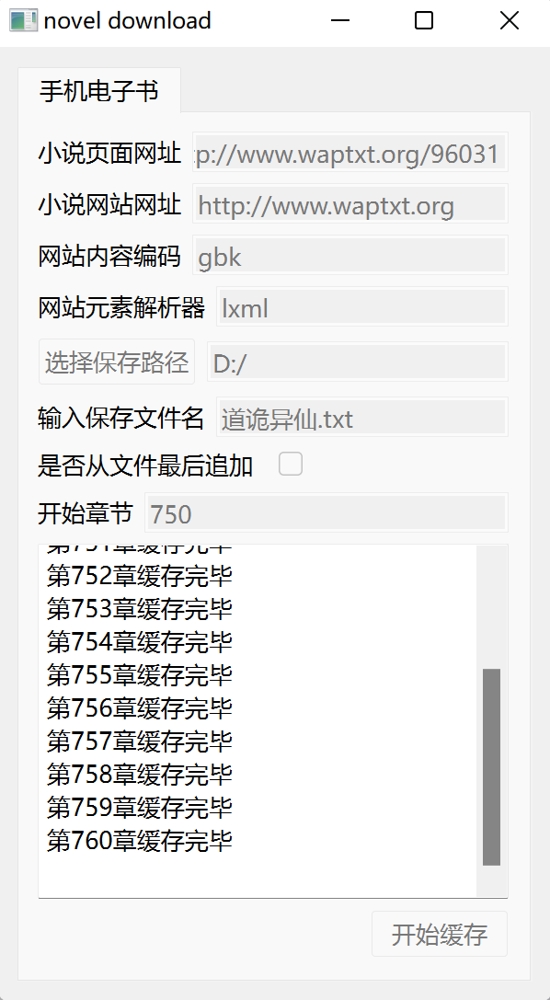
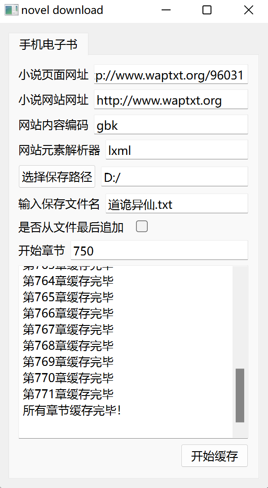

# novel_download

从 [手机电子书](http://www.waptxt.org/) 抓取小说章节，格式化后保存为本地 `.txt` 文件。最初为下载《道诡异仙》而写，支持该站点的任意小说。

## 功能

- 自动遍历分页目录，获取全部章节
- 章节内分页拼接（同一个章节可能分多页显示）
- 支持从指定章节开始下载，支持追加到已有文件
- 输出 UTF-8 编码，排版适配微信读书等本地阅读器
- 两种实现：**Python**（带 GUI）和 **Go**（命令行）

## 快速开始

```bash
# Python 命令行（下载默认小说《道诡异仙》）
python src/spider.py

# Python 图形界面
python src/gui.py

# Go 命令行
cd go && go run .
```

## 使用方法

### Python（有 GUI）

| 文件 | 说明 |
|------|------|
| `src/spider.py` | 命令行直接下载，默认下载《道诡异仙》 |
| `src/gui.py` | PySide6 图形界面，可配置网址、编码、保存路径、起始章节等 |

### Go（命令行）

```bash
# 安装
cd go && go build -o novel-download .

# 默认下载
./novel-download

# 指定书目和输出路径
./novel-download -url http://www.waptxt.org/96031 -o 道诡异仙.txt

# 从第 50 章开始，追加模式
./novel-download -url http://www.waptxt.org/96031 -o 道诡异仙.txt -start 50 -append
```

| 参数 | 说明 | 默认值 |
|------|------|--------|
| `-url` | 小说目录页网址 | `http://www.waptxt.org/96031` |
| `-website` | 小说网站网址 | `http://www.waptxt.org` |
| `-encoding` | 网站编码 | `gbk` |
| `-o` | 输出文件路径 | `道诡异仙.txt` |
| `-append` | 追加到文件末尾（默认覆盖） | `false` |
| `-start` | 起始章节（1-based） | `1` |

## 依赖

### Python

```
bs4 >= 0.0.1
lxml >= 4.9.1
requests >= 2.28.1
PySide6 >= 6.4.1
```

安装：`pip install -r requirements.txt`

### Go

```
golang.org/x/net    （HTML 解析）
golang.org/x/text   （GBK 解码）
```

安装：`cd go && go mod download`

## 构建

`build.py` 支持两种打包模式：

```bash
# 生成独立 Windows exe（需安装 pyinstaller）
python build.py --build pyinstaller

# 生成便携 Python 包（使用内嵌的 python-3.10.11-embed-amd64.zip）
python build.py --build embed
```

## 测试

```bash
cd go && go test ./...
```

## 截图



